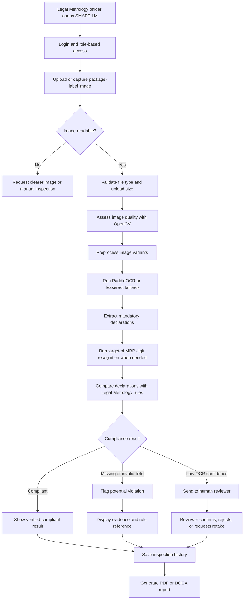

# SMART-LM

Smart Legal Metrology Compliance & Inspection System for SIH 2026 Problem Statement SIH26034.

## Current Project Stage

This project is currently in the local prototype / running-demo stage. The backend and frontend run locally for authentication, inspection workflows, OCR-driven label analysis, compliance checks, review, and report generation.

## Project Access

Open the app here:

- Frontend: http://localhost:5173/
- Backend API: http://localhost:8000/api/health
- OCR health: http://localhost:8000/api/ocr/health
- VLM health: http://localhost:8000/api/vlm/health

If you are running this locally on the same machine, the app is ready to access through the frontend URL above.

## Demo Login Credentials

The backend auto-creates demo users on startup.

- Inspector: `inspector` / `Inspector@123`
- Reviewer: `reviewer` / `Reviewer@123`
- Admin: `admin` / `Admin@123`

## Proposed Solution

SMART-LM is a digital inspection-assistance system for Legal Metrology officers. It analyzes packaged-product label images and automatically checks whether mandatory declarations are present and readable.

The solution:

- accepts a product-label image from the inspector;
- checks image quality and improves the image for recognition;
- reads label text using OCR;
- extracts product name, MRP, net quantity, manufacturer, dates, country of origin, and consumer-care details;
- compares extracted declarations with configurable Legal Metrology rules;
- displays compliance status, confidence, and supporting evidence;
- sends uncertain or incomplete results to a human reviewer;
- stores inspection history and generates PDF or DOCX reports.

SMART-LM supports the officer's decision-making process. It does not replace the final legal decision or physical verification by a qualified inspector.

## Technology Stack Details

### Programming Languages

- **Python:** Backend API, OCR pipeline, image processing, extraction, compliance evaluation, database access, and report generation.
- **TypeScript:** React frontend pages, components, routing, API client, authentication state, and shared data types.
- **JavaScript:** Frontend tooling and Vite runtime modules.
- **HTML:** Frontend document entry point.
- **CSS:** Responsive styling and Tailwind CSS utilities.

### Frameworks and Libraries

- **React:** User interface for login, dashboard, inspection upload, history, review queue, and reports.
- **Vite:** Frontend development server and production bundler.
- **Tailwind CSS:** Responsive application styling.
- **FastAPI:** Backend REST API and request validation.
- **Uvicorn:** ASGI server for running the FastAPI application.
- **Axios:** Frontend-to-backend HTTP communication.
- **OpenCV:** Image quality assessment and OCR preprocessing.
- **NumPy and Pillow:** Image and numerical data processing.
- **PaddleOCR:** Primary OCR engine when available and compatible with the local Paddle runtime.
- **Tesseract 5 with pytesseract:** OCR fallback and targeted MRP digit recognition.
- **SQLAlchemy:** Object-relational database access.
- **Pydantic:** API request and response schemas.
- **ReportLab:** PDF report generation.
- **python-docx:** DOCX report generation.
- **Pytest:** Backend testing.

If PaddleOCR inference encounters a machine-specific runtime failure, the backend records the error and uses the configured Tesseract fallback rather than returning fabricated OCR data. The current verified local run uses this fallback successfully.

### Database and Configuration

- **SQLite:** Local prototype database for users, inspections, declarations, rule evaluations, review actions, and audit logs.
- **JSON rules:** Configurable compliance rules are stored in `backend/rules/rules.json`.
- **Vite proxy:** Frontend `/api` and `/uploads` requests are forwarded to the FastAPI backend on port `8000`.

## Local Run Setup

Use the project virtual environment for the normal local demo. It contains the FastAPI, OCR fallback, and application dependencies used by the verified run.

From PowerShell:

```powershell
cd C:\Users\Manasvi\Documents\sih_project\SIH_PROJECT\backend
& C:\Users\Manasvi\Documents\sih_project\.venv\Scripts\python.exe -m uvicorn main:app --host 0.0.0.0 --port 8000
```

The normal run keeps the expensive PaddleOCR-VL fallback disabled so image analysis remains responsive. To explicitly enable it for difficult or ambiguous images, set these optional environment variables before starting the backend:

```powershell
$env:SMARTLM_ENABLE_VLM = "1"
$env:SMARTLM_VLM_TIMEOUT_SECONDS = "15"
```

The OCR and VLM paths are bounded so a slow model cannot block the whole API request. OCR runs off the FastAPI event loop, and the backend continues with available OCR results if the optional VLM exceeds its time budget. The `/api/vlm/health` endpoint is intentionally lightweight and does not initialize the model.

In a second terminal:

```powershell
cd C:\Users\Manasvi\Documents\sih_project\SIH_PROJECT\frontend
npm install
npm run dev -- --host 0.0.0.0 --port 5173
```

The Vite proxy forwards `/api` and `/uploads` to `http://localhost:8000`.

### Frontend build

```powershell
cd C:\Users\Manasvi\Documents\sih_project\SIH_PROJECT\frontend
npm run build
```

### Backend tests

```powershell
cd C:\Users\Manasvi\Documents\sih_project\SIH_PROJECT\backend
& C:\Users\Manasvi\Documents\sih_project\.venv\Scripts\python.exe -m pytest -q
```

The current verified test result is **82 passed**.

## Solution Workflow



### Workflow Stages

1. **Authentication:** The user logs in as an inspector, reviewer, or administrator.
2. **Image submission:** The inspector uploads a supported package-label image.
3. **Image preparation:** The backend checks quality and creates OCR-friendly image variants.
4. **OCR processing:** Text and bounding boxes are detected from the package label.
5. **Field extraction:** Deterministic patterns identify mandatory declarations; the MRP crop receives an additional digit-focused OCR pass when necessary.
6. **Compliance evaluation:** Each extracted field is evaluated against the rules in `rules.json`.
7. **Decision support:** The system displays status, confidence, evidence text, and rule references.
8. **Human review:** Low-confidence or potentially non-compliant cases are reviewed by an authorized reviewer.
9. **Storage and reporting:** Results, declarations, evaluations, and review actions are stored and can be exported as reports.

## Notes

- This is a prototype system intended for local demo and validation.
- The frontend is served by Vite in development mode.
- The backend uses SQLite for local persistence and demo user creation.
- OCR and VLM functionality may depend on the machine-specific environment, but the project falls back safely when needed.
- PaddleOCR-VL is an optional enhancement, not a requirement for the normal OCR and compliance workflow.
- Clear, well-lit label images generally process faster than blurry, dark, or heavily angled images.
